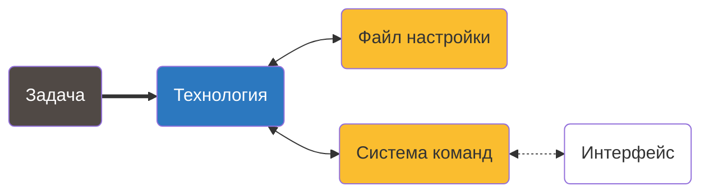

# Шаблон небольшого проекта на C • Начало


### Шаблон небольшого проекта на языке С


- Папки верхнего уровня:
    
    ```c
    build/ -- для компиляции
    data/  -- для работы с данными  
    demo/  -- примеры использования 
    doc/   -- документация
    inlucde/ -- это загаловочные файлы для подключения дополнительных библиотек (API) 
    lib/   -- подключеия библиотек 
    log/   -- запись логот 
    play/  -- проверка проекта 
    src/   -- основной код
    test/  -- для тестов
    tool/  -- инструменты для разработки 
    ```
    
- Установка всех зависимостей в систему:
    
    ```bash
    xargs -a requirements.system sudo apt install -y
    ```
    
- *Именно такой* файл может пригодиться много позже (ключевое слово — `CI`)
- Можно использовать и для настройки среды разработки
- Задача со звёздочкой — зависимость от конфигурации ОС:
    
    ```bash
    # Для разработки модулей ядра нам нужен linux-headers-$(uname -r)
    sed "s|\$(uname -r)|$(uname -r)|g" requirements.system | xargs sudo apt install -y
    ```
    
    <aside>
    
    
    Пора складывать заклинания в `Makefile`
    
    </aside>
    

### Виртуалка • [Docker](https://www.docker.com)-контейнер



- Уберём с железа хотя бы выполнение (а лучше и компиляцию)
- Сам [Docker](https://www.docker.com) не забываем установить. Проверка:
    
    ```bash
       sudo systemctl status docker
    ```
    
- Для начала обзаведёмся операционкой:
    
    ```docker
    FROM ubuntu:latest
    ```
    
    Создадим образ (типа диска для запуска):
    
    ```bash
    docker build -t dev .
    ...
    docker images
    ```
    
    Уже можно заходить:
    
    ```bash
    docker run -it dev
    ...
    docker ps -a
    ```
    
    <aside>
    
    
    Есть много настроек и параметров, но начинать без них — легально
    
    </aside>
    
- Потом это просто `requirements.system` другими словами:
    
    ```docker
    # Устанавливать так:
    # docker build -t dev .
    
    # Базовый дистрибутив
    FROM alpine:3.20
    
    # Дополнительные утилиты
    RUN apk --upgrade add \
    	bash \
    	make \
    	alpine-sdk \
    	valgrind \
    	clang18-extra-tools	
    
    # Программы для редактирования кода
    RUN apk --upgrade add \
    	vim \
    	tmux
    
    # Проверки и проектные утилиты
    RUN apk --upgrade add \
    	check-dev \
    	doxygen \
    	gcovr
    ```
    
- Ну и немножко тюнинга, как будто мы в терминале:
    
    ```bash
    # Мягкая ссылка для совместимости
    RUN ln -s /usr/lib/llvm18/bin/clang-format /usr/bin/clang-format
    
    # Приглашение командной строки
    ENV PS1="\033[90mdev\033[0m \033[33m→\033[0m "
    ```
    
- А как передать в Docker код?
    
    ```bash
    docker run -it -v $(pwd)/../..:/prj dev
    ```
    

- Теперь можно компилировать:
    
    ```bash
    docker run --rm --name compile -v $(pwd)/../..:/prj dev make -C /src main.run
    ```
    

Ах ты ж


- И исполнять:
    
    ```bash
    docker run --rm --name run -v $(pwd)
    ```
    
- Добавить в `Makefile` не так-то просто
    
    ```bash
    PRJ_DIR := $(shell pwd)/../../
    SHELL   := /bin/bash
    ```
    

### Next steps

- Разные системы для запуска и компиляции
- Мультиконтейнерное приложение (как минимум Docker Compose)
- Контейнирование эмуляторов микроконтроллеров
- Другие виртуальные машины
- Удалённый доступ через IDE
- Публикация на [Docker Hub](https://hub.docker.com)
